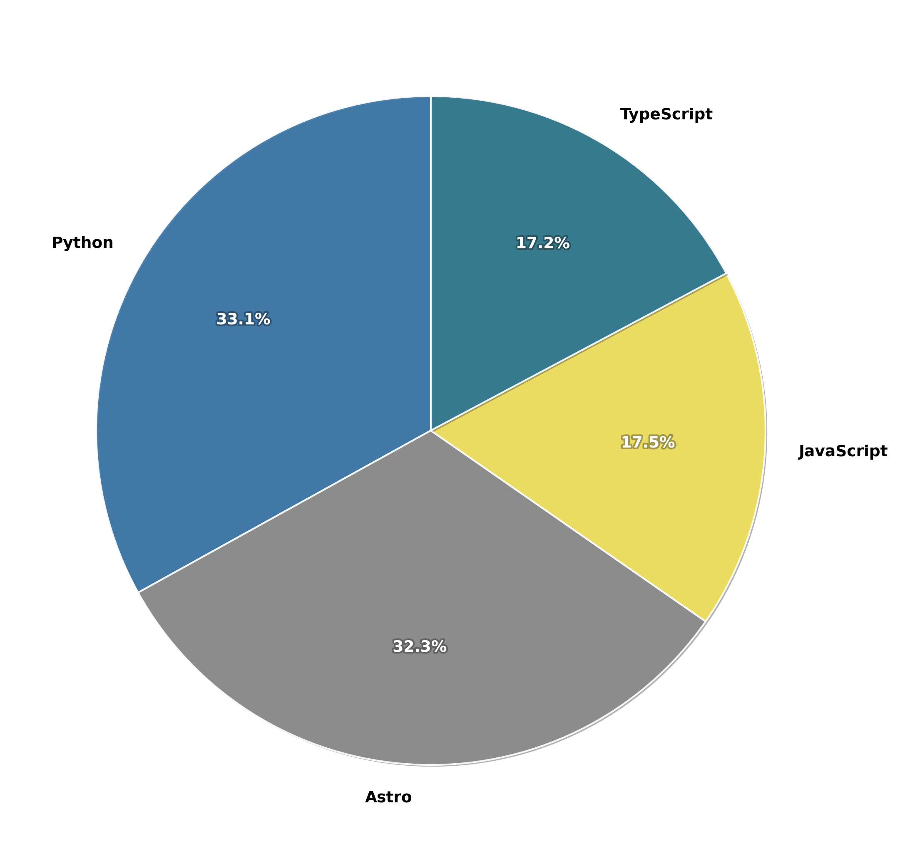

### Hello 👋

Welcome, and take a look around. Everything here is released under the MIT license, so feel free to copy anything you like. On the right, you'll find a pie chart of my most-used programming languages and an overview of my technical stack.
  
My specialization lies in bridging the gap between business and development. I help SaaS founders translate what customers want into what they actually need, seamlessly relaying those requirements to the engineering team.

As a polyglot, international communication is second nature to me. I adapt quickly to new technical landscapes; I can acquire the basics of a new language in just 6 months for any [FSI](https://state.gov) level 1 language, up to 2 years for a level 4 language. Reach out if you'd like to collaborate.  
Let's connect and turn dreams into reality! 🚀

 
